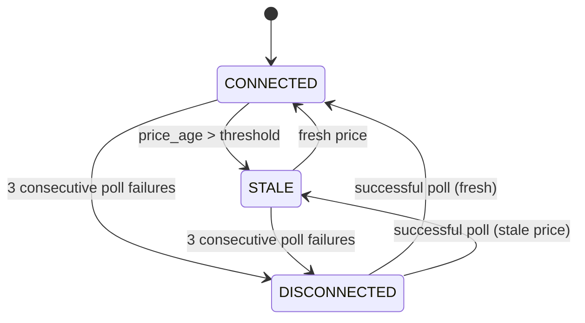

# Dashboard UX Polish Specification

Version: v0.5.2
Date: 2026-02-12
Status: Final Draft (5-reviewer consolidated: Claude, Codex, Gemini, Grok, Grok-FSM)
Target: `dashboard.py` embedded HTML (~400 lines), minimal `bot.py` hardening + status telemetry bridge
Reviewers: Codex (backend), Gemini (visual), Grok (cross-review + FSM-focused), nanobanana (assets)

### Changelog

- **v0.1**: Initial draft.
- **v0.2**: Codex review (input validation, data-contract alignment, stale threshold, refresh rate-limiting, error contract). Gemini review (visual hierarchy, contrast, typography, table/toast polish, industrial aesthetic, responsive).
- **v0.3**: Codex round 2 (factual `detected_trend` fix, catch-all wrapper, pre-lock validation, enforcement policy). Gemini round 2 (CSS bar chart, mobile command bar, phase badge shapes).
- **v0.4**: Grok cross-review (chord timeout consistency, confirmation formula, S2 blink threshold, S1a/S1b glyph differentiation, command-to-API mapping table, parser pseudocode, stale overlay visual spec, table sort details, >9 slot navigation, preventDefault, command history, prefers-reduced-motion, ARIA sort/live, skip link, sticky headers, pre-lock completeness, bar chart a11y, high-DPI texture note, version display).
- **v0.5**: Grok FSM-focused review (formal state definitions, Mermaid diagram, HELP/CONFIRM as mode states, DISCONNECTED state, transition table with guards, poll debounce during modal modes, confirmation division-by-zero edge case, state-dependent command validation, localStorage persistence for sort/slot selection, poll failure counter for heartbeat).
- **v0.5.1**: Codex cross-spec audit (S1a/S1b label+glyph swap fix, S2 fallback 1800s not 300s, "overlay"→"view" wording for Factory Lens, test item 7 FSM alignment, STATE_MACHINE.md forward-compat notes).
- **v0.5.2**: Manual scaling telemetry alignment: added implemented `capacity_fill_health` contract, Capacity & Fill Health summary card, and backend/config references for open-order headroom + partial-fill monitoring.

---

## 1. Current State Assessment

The dashboard is a single embedded HTML page served at `/`. It polls `GET /api/status` every 5 seconds and sends commands via `POST /api/action`.

### What exists

1. Dark theme with GitHub-style color tokens.
2. Two-column layout (controls left, slot data right) at 960px+.
3. Slot selection via mouse click on pill buttons.
4. Controls: Pause, Resume, Add Slot, Soft Close, Entry%/Profit% inputs.
5. Three data tables: Open Orders, Orphaned Exits, Recent Cycles.
6. Summary panel with PnL, round trips, orphan count.
7. Capacity & Fill Health summary card driven by `/api/status.capacity_fill_health` (status band, open-order utilization/headroom/runway, partial-fill counts, fill latency, risk hints).

### What's missing

1. **Zero keyboard navigation.** No `tabindex`, no focus rings, no key handlers.
2. **No focus management.** Tab order is undefined; slot selection is mouse-only.
3. **No confirmation dialogs.** Pause, Soft Close, parameter changes fire immediately.
4. **No loading/error states.** API failures show a text line in `#ctlMsg` only.
5. **No ARIA roles or landmarks.** Inaccessible to screen readers.
6. **Tables are static.** No sorting, no column highlighting, no empty states.
7. **No help/keybinding reference.** New users have no discoverability path.
8. **No visual freshness indicator.** No way to tell if data is current or stale.
9. **No toast/notification system.** Action feedback is a single mutable text span.
10. **Compact slot row is mouse-only.** Cannot cycle slots from keyboard.
11. **No responsive behavior below 960px.** Stacks to single column but no adaptation.
12. **No favicon or branding.** Tab shows generic browser icon.
13. **No client-side input validation.** Command mode can send malformed values to backend.

---

## 2. Design Principles

1. **Keyboard-first, mouse-friendly.** Every action reachable from keyboard. Mouse still works.
2. **VIM-flavored, not VIM-cloned.** Use modal navigation concepts (`hjkl`, `/`, `?`, `:`) but don't require VIM literacy. Arrow keys always work as aliases.
3. **Minimal backend surface.** Frontend-only where possible. Permitted backend changes are limited to input hardening, exception safety, and new read-only status fields (see section 11).
4. **Progressive disclosure.** Core view is clean; keybindings, help, and detail drawers are opt-in.
5. **Operator-first aesthetic.** Dense information display. No wasted space. Factory/industrial feel with subtle texture hints.
6. **Zero-interference.** UX changes must not alter trading decisions, polling frequency, or bot behavior. Permitted backend changes are strictly read-path additions and parse-safety improvements.

---

## 3. Keyboard Navigation Model

### 3.1 Modes

The UI has five modes, indicated by a subtle mode badge in the header. See section 7.5 for the formal FSM with transitions and guards.

| Mode | Entry | Exit | Purpose |
|------|-------|------|---------|
| **NORMAL** | Default / `Esc` from any mode | `:` → COMMAND, `?` → HELP | Navigate panels, select slots, read data |
| **COMMAND** | `:` | `Enter` (execute) / `Esc` (cancel) → NORMAL | Execute named actions (pause, resume, set values) |
| **HELP** | `?` | `Esc` / `?` → NORMAL | Read-only keybinding overlay |
| **CONFIRM** | Triggered by destructive/large-change action | `Enter` (confirm) / `Esc` (cancel) → NORMAL | Blocks all input except Y/N confirmation |
| **INPUT** | Focus on `<input>` element | `Esc` / blur → NORMAL | Native text entry; keys pass through |

There is no INSERT mode. Text inputs auto-enter INPUT mode when focused; `Esc` returns to NORMAL.

**Important**: All NORMAL, COMMAND, HELP, and CONFIRM mode key handlers must call `event.preventDefault()` to suppress browser defaults (Space = scroll, `/` = find, etc.). Only INPUT mode passes keys through natively.

### 3.2 NORMAL Mode Keybindings

#### Panel Navigation

| Key | Alias | Action |
|-----|-------|--------|
| `h` | `ArrowLeft` | Focus previous panel |
| `l` | `ArrowRight` | Focus next panel |
| `j` | `ArrowDown` | Next item in current panel (slot, table row, orphan) |
| `k` | `ArrowUp` | Previous item in current panel |
| `Tab` | | Cycle panels forward |
| `Shift+Tab` | | Cycle panels backward |
| `Enter` | | Activate focused element (expand detail, trigger button) |
| `Esc` | | Close drawer/modal, return to NORMAL, deselect |

#### Slot Navigation

| Key | Action |
|-----|--------|
| `1`-`9` | Jump to slot by index (1=first, 2=second, ...) |
| `]` | Next slot |
| `[` | Previous slot |
| `g g` | Jump to first slot (chord) |
| `G` | Jump to last slot |

For **more than 9 slots**: use `]`/`[` to cycle, or `:jump N` command (see 3.3). The `1`-`9` keys address the first 9 slots by position.

#### Table Navigation

| Key | Action |
|-----|--------|
| `j` / `k` | Move row highlight up/down in focused table |
| `o` | Sort table by next column |
| `O` | Sort table by previous column |
| `r` | Reverse sort direction |

#### Quick Actions

| Key | Action |
|-----|--------|
| `p` | Toggle pause/resume |
| `+` | Add slot |
| `-` | Soft close next recovery |
| `?` | Toggle help overlay |
| `/` | Focus search/filter (future: filter table rows) |
| `.` | Force refresh now (rate-limited, see 3.5) |
| `Space` | Toggle detail drawer for selected slot |

### 3.3 COMMAND Mode

Entered with `:` (colon). A command bar appears at the bottom of the screen.

| Command | Action | API Payload |
|---------|--------|-------------|
| `:pause` | Pause bot | `{action: "pause"}` |
| `:resume` | Resume bot | `{action: "resume"}` |
| `:add` | Add slot | `{action: "add_slot"}` |
| `:close` | Soft close next (oldest recovery) | `{action: "soft_close_next"}` |
| `:close <slot> <rid>` | Soft close specific recovery | `{action: "soft_close", slot_id: N, recovery_id: M}` |
| `:set entry <value>` | Set entry % | `{action: "set_entry_pct", value: X.Y}` |
| `:set profit <value>` | Set profit % | `{action: "set_profit_pct", value: X.Y}` |
| `:jump <N>` | Jump to slot N (for >9 slots) | Client-side only, no API call |
| `:q` | No-op (VIM habit safety) | No API call |

Command bar supports `Esc` to cancel, `Enter` to execute, `Tab` for completion, `Up`/`Down` for command history.

#### 3.3.1 Command Parser

Tokenization pseudocode:

```js
const raw = input.value.trim();
if (!raw.startsWith(':')) return;
const tokens = raw.slice(1).trim().split(/\s+/);
const verb = tokens[0] || '';

if (verb === 'set' && tokens.length >= 3) {
  const sub = tokens[1];    // 'entry' | 'profit'
  const val = parseFloat(tokens[2]);
  if (sub === 'entry')  return { action: 'set_entry_pct', value: val };
  if (sub === 'profit') return { action: 'set_profit_pct', value: val };
  return { error: 'unknown set target: ' + sub };
}
if (verb === 'close' && tokens.length >= 3) {
  return { action: 'soft_close', slot_id: parseInt(tokens[1]), recovery_id: parseInt(tokens[2]) };
}
if (verb === 'close') return { action: 'soft_close_next' };
// ... simple verb lookup for pause, resume, add, jump, q
```

#### 3.3.2 Client-Side Input Validation

Before any command dispatches to `/api/action`, the client must validate:

1. **Numeric coercion**: `:set entry` and `:set profit` values must parse as finite positive floats. Reject `NaN`, `Infinity`, negative, non-numeric.
2. **Range check**: `entry` and `profit` values must be `>= 0.05` and `<= 50.0`. These are **UI ergonomic bounds**, not API-enforced limits. The backend only enforces safety minimums (`>= 0.05` for entry, `>= fee floor` for profit). The upper bound is a client-side guardrail to prevent fat-finger errors.
3. **Integer coercion**: `:close <slot> <rid>` arguments must parse as non-negative integers.
4. **Unknown commands**: anything not in the command table produces an error toast, no API call.

Validation failures show an error toast and do not send any request.

#### 3.3.3 Command Auto-Complete

Known completions: `pause`, `resume`, `add`, `close`, `set entry`, `set profit`, `jump`, `q`.

- Prefix matching: typing `pa` shows `pause`.
- `Tab` cycles through matching suggestions.
- Max 5 suggestions shown above the command bar.
- No fuzzy matching in v0.4; exact prefix only.

#### 3.3.4 Command History

The command bar stores the last 20 executed commands in an in-memory array.

- `Up` arrow: recall previous command.
- `Down` arrow: recall next command (or clear to empty).
- History resets on page reload (intentionally not persisted — commands are context-sensitive).

### 3.4 Focus Model

The page has 6 focusable regions (panels), cycled via `Tab` or `h`/`l`:

1. **Summary** (left panel, separate region)
2. **Controls** (left panel, separate region — visually distinct from Summary)
3. **Slot Bar** (right panel slot pills)
4. **Orders Table** (right panel open orders)
5. **Orphans Table** (right panel orphaned exits)
6. **Cycles Table** (right panel recent cycles)

Active panel gets a subtle left-border accent color + background shift. Focused item within panel gets a highlight row/outline.

> Controls and Summary are separate focusable panels. This improves scanability by separating actionable elements from informational ones.

### 3.5 Force Refresh Rate Limiting

The `.` key triggers an immediate `GET /api/status` but is rate-limited:

1. Minimum interval: 2 seconds between manual refreshes.
2. If pressed during cooldown, show an info toast ("refresh cooldown, Ns remaining") and skip the call.
3. Manual refresh does not reset the 5-second auto-poll timer — the next auto-poll fires on its normal schedule.

This prevents unbounded API traffic and reduces lock contention on the runtime.

---

## 4. Visual Polish

### 4.1 Color System Refinement

Keep existing CSS custom properties. Add:

```css
--focus: #1f6feb;        /* focus ring / active panel border */
--surface: #0d1117;      /* true background for inputs/modals */
--toast-bg: #1c2128;     /* notification background */
--cmd-bg: #161b22;       /* command bar background */
--zebra: rgba(255,255,255,0.015);  /* alternating table row tint */
--backdrop: rgba(0,0,0,0.5);      /* modal backdrop */
```

#### 4.1.1 Contrast Compliance

Verify WCAG AA 4.5:1 contrast ratios for all text/background combinations:

| Text color | Background | Ratio | Status |
|-----------|-----------|-------|--------|
| `--muted` (#8b949e) | `--panel` (#161b22) | ~4.7:1 | Pass (marginal) |
| `--ink` (#e6edf3) | `--panel` (#161b22) | ~12:1 | Pass |
| `--focus` (#1f6feb) | `--bg` (#0d1117) | ~3.8:1 | **Needs icon/text supplement** |
| `--focus` (#1f6feb) | `--panel` (#161b22) | ~3.5:1 | **Needs icon/text supplement** |

Where `--focus` is used as the sole indicator (panel borders, focus rings), ensure a secondary visual cue exists (border weight change, background shift, or text label).

Test colorblind rendering with browser devtools emulation (protanopia, deuteranopia, tritanopia) during P6/P9.

### 4.2 Focus Indicators

- Active panel: 2px left border in `--focus` color + subtle background shift (`rgba(31,111,235,0.04)`).
- Focused slot pill: box-shadow glow (`0 0 0 2px var(--focus)`).
- Focused table row: background `rgba(31,111,235,0.08)` with 2px left accent stripe.
- All interactive elements: visible focus ring on `:focus-visible`. `:focus-visible` must be equally or more prominent than `:hover`.
- Active/pressed button state: `background` darkens slightly + `transform: scale(0.98)` for tactile feedback.
- Remove all `outline: none` overrides.

### 4.3 State Bar Enhancement

Current state bar is minimal. Add:

1. **Phase badge** with filled/opaque background color (not just text color) and **shape glyph** for silhouette-level readability:
   - S0 (entry phase): `●` circle, accent color fill.
   - S1a (A-side active — short in position, buy exit pending): `▼` down-triangle, warn color fill.
   - S1b (B-side active — long in position, sell exit pending): `▲` up-triangle, warn color fill.
   - S2 (both exits pending): `■` square, bad color fill, blinking when elapsed > 75% of orphan timeout (see 4.3.1).
2. **Degraded mode indicator**: `[SO]` short-only or `[LO]` long-only in warn color when applicable. Rendered with `title` tooltip explaining the condition.
3. **Trend indicator**: derived from `long_only` / `short_only` flags on the current slot (see section 11.2.1 for details). Shows directional arrow when a slot is in one-sided mode. Placed in state bar next to phase badge. Updated every poll. Color: `--bad` for `▼`, `--good` for `▲`, `--muted` for `◆`.
4. **S2 timer**: if slot is in S2, show elapsed time since entry, derived from `s2_entered_at` field (already on `PairState`).

> Phase badge shape language allows state to be read purely by silhouette, reinforcing industrial accessibility. All glyphs and abbreviations get `title` tooltip fallbacks.

#### 4.3.1 S2 Blink Threshold

The S2 badge blinks when the slot's elapsed S2 time exceeds 75% of the orphan timeout. The dashboard reads `s2_orphan_after_sec` from the status payload (see section 11.2). If absent, falls back to a hardcoded 1800s default (matching `config.S2_ORPHAN_AFTER_SEC` = 30 minutes).

Blink: CSS `animation` toggling opacity 1.0 → 0.3 at 1Hz. Disabled under `prefers-reduced-motion` (see section 8.1).

### 4.4 Data Freshness

1. **Heartbeat dot** in header: green pulsing dot when last poll < 10s ago, yellow when 10-30s, red when > 30s. Animation is subtle opacity fade (0.4 to 1.0, 2s cycle), not a size bounce.
2. **Relative timestamp** next to price: concise format "2s" or "2s ago". No long-form text.
3. **Disconnected state**: After 3 consecutive poll failures, the dashboard enters DISCONNECTED display state (see 7.5 FSM). Heartbeat dot turns red (static, no pulse), header shows `DISCONNECTED` badge in `--bad` color. Data panels remain visible but dimmed. Auto-poll continues at normal 5s interval (no exponential backoff — the bot may recover at any time). First successful poll clears DISCONNECTED immediately.
4. **Stale overlay**: triggers when price age exceeds runtime's `STALE_PRICE_MAX_AGE_SEC` (default 60s). The dashboard reads this threshold from `stale_price_max_age_sec` on the status payload (see section 11.2). If absent, falls back to 60s. Visual appearance:
   - Semi-transparent red-tinted overlay (`rgba(248,81,73,0.06)`) dims the entire data area.
   - Centered `STALE DATA` badge in `--bad` color with `--panel` background, large text.
   - Tables and slot bar remain visible but dimmed.
   - Overlay auto-dismisses on next successful poll with fresh price.

### 4.5 Toast Notifications

Replace `#ctlMsg` text span with a toast stack:

1. Toasts appear in bottom-right corner.
2. Auto-dismiss: **4 seconds** for success/info, **8 seconds** for error toasts. Error toasts also show a small dismiss "x" button for manual close.
3. Types: `success` (green left border), `error` (red left border), `info` (blue left border).
4. Max 3 visible toasts. Older ones slide out via `transform`/`opacity` CSS transition.
5. Action feedback (pause, resume, set values) always produces a toast.

### 4.6 Empty States

Each table shows a centered muted message when empty:

- Open Orders: "No open orders"
- Orphaned Exits: "No orphaned exits"
- Recent Cycles: "No completed cycles yet"

Text is `--muted` color, 13px, vertically centered in the table area.

### 4.7 Favicon & Version

**Favicon**: Generate via nanobanana: a stylized "D" with a small gear or circuit-line motif. 32x32 and 16x16 variants. Dark background compatible. Deliver as PNG for base64 data URI embedding in `<head>`. Keep very simple at 16x16.

**Version display**: Show `v0.5.2` in the header bar as a small `--muted` text element, right-aligned. Tooltip links to changelog section. Helps operators identify which UX version they're on.

### 4.8 Typography Refinement

1. **Base font sizes**: bump table cells to `13px` (from 12px). Key/value rows in summary to `14px` (from 13px).
2. Apply `font-variant-numeric: tabular-nums` globally on `body`, not just on `.v` elements.
3. Apply monospace font stack (`ui-monospace, SFMono-Regular, Menlo, Consolas, monospace`) to all numeric table cells, not just elements with `.mono`.
4. Consistent decimal places: USD always 4dp in summary, 6dp in order/cycle tables. Percentages always 2-3dp. Note: if swarm adds BTC/ETH pairs with different precision needs, make decimal formatting asset-aware.
5. Right-align all numeric columns in tables.
6. Profit values: `color: var(--good)` for positive, `color: var(--bad)` for negative, `color: var(--muted)` for zero.
7. Consistent color-coding everywhere profit/loss appears — summary, slot detail, tables, toast messages.

### 4.9 Industrial Aesthetic

To push toward a "factory control panel" feel without sacrificing readability:

1. **Subtle grid texture**: CSS-only background on `body` using a repeating linear gradient that creates a faint grid pattern (1px lines at ~40px intervals, `rgba(255,255,255,0.02)`). Must be nearly invisible — test on multiple monitors including high-DPI/retina displays.
2. **Live indicators**: a faint pulsing border glow (opacity 0.3 to 0.6, 3s cycle) on the active panel when bot mode is RUNNING. Stops when PAUSED/HALTED.
3. **Command bar terminal feel**: monospace font, `--cmd-bg` background, blinking cursor, left-aligned `:` prefix in `--muted` color.
4. **Mode badge**: small, pill-shaped, in header next to bot mode. Shows `NORMAL` in muted color or `COMMAND` in accent color.

### 4.10 Table Polish

1. **Zebra striping**: alternating rows get `background: var(--zebra)`. Must remain visible under focus highlight.
2. **Row hover**: `rgba(255,255,255,0.03)` on `:hover`. Distinct from focus highlight (`rgba(31,111,235,0.08)`).
3. **Sort column header**: when a table column is the sort key, show a small arrow indicator (`▲`/`▼` via CSS `::after`) and slightly brighter header text.
4. **Soft Close buttons**: ensure minimum 36x32 hit area on orphaned exit close buttons. Add `padding: 4px 8px` minimum.

#### 4.10.1 Sortable Columns

| Table | Sortable Columns | Default Sort |
|-------|-----------------|-------------|
| Open Orders | Type, Trade, Cycle, Volume, Price | None (insertion order) |
| Orphaned Exits | Trade, Age, Dist%, Price | Age descending |
| Recent Cycles | Trade, Cycle, Entry, Exit, Net | Cycle descending |

Sort behavior:

- `o` cycles to next column in table's sortable list. `O` cycles backward.
- `r` reverses direction (ascending ↔ descending).
- Sort state is **per-table**, persisted in `localStorage` (keyed `doge-dash-sort-{table}`) so it survives page reloads. Falls back to default if storage is unavailable.
- Column header shows `▲` (ascending) or `▼` (descending) on the active sort column.
- Header gets `aria-sort="ascending|descending|none"` for accessibility.

### 4.11 Capacity & Fill Health Card (Implemented Baseline)

The summary panel includes a read-only card sourced from `status.capacity_fill_health`:

1. `status_band` -> visual status (`NORMAL`, `CAUTION`, `STOP`).
2. Open-order utilization line:
   - `open_orders_current / open_orders_safe_cap`
   - utilization percent (`open_order_utilization_pct`)
   - source tag (`open_orders_source`: `kraken` or `internal_fallback`)
3. Capacity runway:
   - `open_order_headroom`
   - `estimated_slots_remaining`
4. Partial-fill pressure:
   - `partial_fill_open_events_1d`
   - `partial_fill_cancel_events_1d`
5. Fill latency:
   - `median_fill_seconds_1d / p95_fill_seconds_1d`
6. Risk hints:
   - render `blocked_risk_hint[]` as compact comma-separated diagnostics.

Color mapping for `status_band`:

1. `STOP` -> `--bad`
2. `CAUTION` -> `--warn`
3. `NORMAL` -> `--good`

---

## 5. Interaction Improvements

### 5.1 Confirmation Dialog

Destructive actions require confirmation:

| Action | Confirmation? | Dialog Text |
|--------|--------------|-------------|
| Pause | Yes | "Pause bot? Active orders remain open." |
| Resume | No | Immediate |
| Add Slot | No | Immediate |
| Soft Close specific | Yes | "Close recovery #N on slot #M?" |
| Soft Close next | Yes | "Close oldest recovery order?" |
| Set Entry % | Yes if relative change > 50% | "Change entry from X% to Y%?" |
| Set Profit % | Yes if relative change > 50% | "Change profit from X% to Y%?" |

**Relative change formula**: `Math.abs(newVal - oldVal) / oldVal > 0.5`. Example: 1.0% → 2.0% triggers (100% change). 10.0% → 14.0% does not (40% change).

Edge cases:
- `oldVal === 0`: always confirm (any change from zero is infinite relative change).
- `newVal === oldVal`: no-op, skip API call entirely (no toast either).
- Negative values: impossible — client validation (3.3.2) rejects negative before this check runs.

Confirmation dialog:

1. Semi-transparent backdrop (`var(--backdrop)`).
2. Centered dialog box with `--panel` background and `--line` border.
3. Two buttons: "Confirm" (accent-colored, primary weight) and "Cancel" (muted, secondary weight).
4. `Enter` confirms, `Esc` cancels. Focus trapped inside dialog.
5. Dialog is keyboard-navigable: `Tab` moves between buttons, `Enter` activates focused button.

### 5.2 Slot Detail Drawer

Pressing `Enter` or `Space` on a selected slot opens a slide-out drawer from the right with:

1. Full slot state: phase, mode, cycles, all orders.
2. **Slot-level PnL bar chart** from recent cycles: CSS-only flexbox with `div` bars of varying height. Green bars for profit, red bars (pointing downward) for loss. Each bar gets `role="img"` and hidden text fallback (e.g., `aria-label="Cycle 5: +$0.0023"`). Aligns with discrete-cycle mental model; avoids SVG anti-aliasing issues.
3. Recovery order management (close buttons per recovery).
4. Degraded mode indicator with explanation text (e.g., "Short-only: buy-side entry placement blocked by insufficient DOGE").

Drawer closes with `Esc` or `q`.

### 5.3 Help Overlay

`?` toggles a centered modal showing all keybindings grouped by category. Styled as a monospace cheatsheet.

Layout (three columns, grouped by function):

```
┌─ Keybindings ──────────────────────────────────┐
│                                                 │
│  NAVIGATION          ACTIONS          TABLES    │
│  h/l   panels        p    pause       j/k  rows │
│  j/k   items         +    add slot    o/O  sort │
│  1-9   slot jump     -    close next  r    flip │
│  [/]   prev/next     .    refresh              │
│  gg    first slot    :    command              │
│  G     last slot     ?    this help            │
│                      Spc  detail               │
│                      Esc  close                │
│                                                 │
│  COMMAND BAR                                    │
│  :pause  :resume  :add  :close                 │
│  :set entry N  :set profit N  :jump N          │
│  Tab=complete  Up/Down=history  Esc=cancel      │
│                                                 │
└──────────────────────── Esc to close ──────────┘
```

Modal uses `var(--backdrop)` overlay, `role="dialog"`, focus trapped.

### 5.4 Command Bar

`:` opens a command input at the bottom of the viewport:

- `--cmd-bg` background, monospace font, blinking cursor, colon prefix visible in `--muted`.
- Auto-complete suggestions appear above the input (max 5 suggestions, prefix-matched).
- `Esc` dismisses without action.
- `Enter` executes (after client-side validation per 3.3.2) and dismisses.
- `Up`/`Down` cycles command history (see 3.3.4).
- Invalid commands show error toast.
- Unrecognized commands never reach the backend.

#### 5.4.1 Mobile Command Bar Positioning

On viewports below 600px, the virtual keyboard pushes up `position: fixed; bottom: 0` elements unpredictably (especially iOS Safari). At the `< 600px` breakpoint:

1. **Preferred**: position command bar at the **top** of the screen (`position: fixed; top: 0`). Eliminates iOS Safari keyboard push entirely.
2. **Fallback** (if top positioning causes occlusion issues): anchor to `window.visualViewport.height` via JS `resize` listener.
3. Note: hardware Bluetooth keyboards on mobile work with all keybindings; on-screen keyboard only relevant for command bar.
4. Test on iOS Safari and Android Chrome before shipping.

---

## 6. Responsive Considerations

### 6.1 Breakpoints

| Width | Layout |
|-------|--------|
| >= 960px | Two-column (current) |
| 600-959px | Single column, controls collapse to icon row with tooltips |
| < 600px | Single column, tables scroll horizontally with edge shadow indicator, slot pills wrap or scroll |

### 6.2 Mobile Touch

Not a priority but avoid breaking touch:
- Slot pills remain tappable (min 44x44 hit area). If >5 pills, enable horizontal scroll with edge shadow (same as tables).
- Buttons remain tappable.
- No hover-only interactions.
- At medium breakpoint, collapsed icon buttons show tooltip on hover/long-press.

### 6.3 Horizontal Scroll Indicator

On narrow viewports where tables overflow, show a subtle gradient shadow on the scrollable edge to indicate more content exists. CSS-only using `::after` pseudo-element with a horizontal gradient fade.

### 6.4 Sticky Table Headers

When tables scroll horizontally, column headers (`<thead>`) get `position: sticky; top: 0` within the scroll container so operators don't lose column context.

---

## 7. Implementation Structure

### 7.1 File Organization (still embedded)

The HTML remains a single string in `dashboard.py` but should be internally organized:

```
<style>
  /* 1. Reset & tokens */
  /* 2. Layout (panels, grid) */
  /* 3. Components (badges, tables, toasts, modals, command bar) */
  /* 4. Focus & keyboard states */
  /* 5. Responsive */
  /* 6. Animations (heartbeat, panel glow, toast slide) */
  /* 7. Industrial texture */
  /* 8. Reduced-motion overrides */
</style>

<body>
  <!-- 0. Skip link (visually hidden) -->
  <!-- 1. Header bar (mode badge, heartbeat, price, version) -->
  <!-- 2. Main grid (id="main") -->
  <!--    2a. Summary panel -->
  <!--    2b. Controls panel -->
  <!--    2c. Slot detail panel (slot bar, state bar, tables) -->
  <!-- 3. Command bar (hidden by default) -->
  <!-- 4. Help modal (hidden) -->
  <!-- 5. Confirm modal (hidden) -->
  <!-- 6. Detail drawer (hidden) -->
  <!-- 7. Toast container -->
  <!-- 8. ARIA live region for mode announcements -->
  <!-- 9. ARIA live region for table refresh announcements -->
</body>

<script>
  // 1. State & render (deferred update queue for poll debounce, see 7.5.3)
  // 2. API layer (with error normalization, see 7.4)
  // 3. Connection FSM (CONNECTED/STALE/DISCONNECTED, see 7.5.2)
  // 4. Keyboard engine (5-mode FSM, dispatch, chords, preventDefault, see 7.5.1)
  // 5. Focus manager (panel cycle, item tracking)
  // 6. Command parser (tokenizer, validation per 3.3.2, state guards per 7.5.4)
  // 7. Command history (in-memory ring buffer)
  // 8. Toast system
  // 9. Confirmation dialogs
  // 10. Sort state per table (localStorage backed, see 7.5.5)
  // 11. localStorage persistence layer (see 7.5.5)
  // 12. Event wiring
</script>
```

### 7.2 Keyboard Engine Architecture

```
KeyboardEngine {
  mode: 'normal' | 'command' | 'input' | 'help' | 'confirm'
  chordBuffer: string       // for multi-key sequences like 'gg'
  chordTimeout: 400ms       // 400ms for non-VIM-user friendliness

  onKeyDown(event):
    if mode == 'input': pass through to native input
    if mode == 'help':
      event.preventDefault()
      only Esc and ? accepted (close overlay → NORMAL)
    if mode == 'confirm':
      event.preventDefault()
      only Enter (confirm) and Esc (cancel) accepted → NORMAL
    if mode == 'command':
      route to command bar (Up/Down = history, Tab = complete)
      event.preventDefault()
    if mode == 'normal':
      event.preventDefault()
      append to chordBuffer
      if chordBuffer matches known chord -> execute, clear
      else if timeout -> try single key, clear
}
```

Chord support needed for: `gg` (first slot).

All other bindings are single-key. See section 7.5 for the full state machine with transitions and guards.

### 7.3 Focus Manager Architecture

```
FocusManager {
  panels: ['summary', 'controls', 'slotbar', 'orders', 'orphans', 'cycles']
  activePanel: number
  activeItem: number        // index within current panel

  focusPanel(index):
    highlight panel border + background shift
    reset activeItem to 0

  focusItem(index):
    highlight row/element within panel

  nextPanel() / prevPanel():
    cycle activePanel, call focusPanel
}
```

### 7.4 API Error Normalization

The `api()` helper must handle all backend response shapes gracefully:

1. **JSON 200**: normal success path.
2. **JSON 400**: extract `message` field, show error toast.
3. **JSON 500**: show error toast "Server error — check bot logs".
4. **Non-JSON response** (HTML error page, empty body): show error toast "Unexpected response from server".
5. **Network failure** (fetch throws): show error toast "Connection lost — retrying".
6. **Timeout** (no response in 10s): show error toast "Request timed out".

In all error cases, the dashboard remains functional. Error toasts persist for 8 seconds per section 4.5.

### 7.5 State Management FSM

The dashboard has two orthogonal state machines: the **UI mode FSM** (keyboard/interaction) and the **connection FSM** (data freshness). They run independently — any UI mode can coexist with any connection state.

#### 7.5.1 UI Mode FSM

**States**:

| State | Description | Keys accepted |
|-------|-------------|---------------|
| `NORMAL` | Default. Navigate, select, quick actions. | All NORMAL bindings (3.2) |
| `COMMAND` | Command bar open. Parsing input. | `Enter`, `Esc`, `Up`, `Down`, `Tab`, printable chars |
| `HELP` | Help overlay visible. Read-only. | `Esc`, `?` (toggle close) |
| `CONFIRM` | Confirmation dialog visible. Blocks all else. | `Enter` (confirm), `Esc` (cancel) |
| `INPUT` | Native `<input>` focused. Keys pass through. | All (native browser handling) |

**Transitions**:

| From | Event | Guard | To | Side Effect |
|------|-------|-------|----|-------------|
| `NORMAL` | keypress `:` | — | `COMMAND` | Show command bar, focus input |
| `NORMAL` | keypress `?` | — | `HELP` | Show help overlay |
| `NORMAL` | focus `<input>` | — | `INPUT` | — |
| `NORMAL` | destructive action | Requires confirmation (5.1) | `CONFIRM` | Show confirm dialog |
| `NORMAL` | `:set` with large change | `oldVal === 0 \|\| relChange > 0.5` | `CONFIRM` | Show confirm dialog |
| `COMMAND` | `Enter` | Parse succeeds (3.3.1) | `NORMAL` | Execute action, dismiss bar |
| `COMMAND` | `Enter` | Parse fails | `COMMAND` | Error toast, bar stays open |
| `COMMAND` | `Esc` | — | `NORMAL` | Dismiss bar, no action |
| `HELP` | `Esc` or `?` | — | `NORMAL` | Dismiss overlay |
| `CONFIRM` | `Enter` | — | `NORMAL` | Execute confirmed action |
| `CONFIRM` | `Esc` | — | `NORMAL` | Cancel, no action |
| `INPUT` | `Esc` or blur | — | `NORMAL` | Remove input focus |

**Invariants**:
- Exactly one mode is active at all times.
- Mode changes are always announced via `aria-live="polite"` region.
- No mode transition can occur from CONFIRM except via `Enter` or `Esc` (blocks everything else).
- Chord buffer is cleared on any mode exit from NORMAL.

**Mermaid diagram**:



```mermaid
stateDiagram-v2
    [*] --> NORMAL

    NORMAL --> COMMAND : ":"
    NORMAL --> HELP : "?"
    NORMAL --> CONFIRM : destructive action / large %Δ
    NORMAL --> INPUT : focus <input>

    COMMAND --> NORMAL : Enter (valid) / Esc
    HELP --> NORMAL : Esc / "?"
    CONFIRM --> NORMAL : Enter (confirm) / Esc (cancel)
    INPUT --> NORMAL : Esc / blur
```

#### 7.5.2 Connection FSM

**States**:

| State | Entry condition | Visual |
|-------|----------------|--------|
| `CONNECTED` | Last poll succeeded, price age < stale threshold | Green heartbeat dot |
| `STALE` | Poll succeeds but price age > `stale_price_max_age_sec` | Yellow/red dot + stale overlay (4.4) |
| `DISCONNECTED` | 3 consecutive poll failures | Red dot (static) + `DISCONNECTED` badge (4.4 item 3) |

**Transitions**:

| From | Event | To |
|------|-------|----|
| `CONNECTED` | price age > stale threshold | `STALE` |
| `CONNECTED` | poll failure (count < 3) | `CONNECTED` (increment failure counter) |
| `CONNECTED` | poll failure (count >= 3) | `DISCONNECTED` |
| `STALE` | fresh price received | `CONNECTED` |
| `STALE` | poll failure (count >= 3) | `DISCONNECTED` |
| `DISCONNECTED` | successful poll with fresh price | `CONNECTED` |
| `DISCONNECTED` | successful poll with stale price | `STALE` |

Poll failure counter resets to 0 on any successful poll.

**Mermaid diagram**:



#### 7.5.3 Poll Debounce During Modal Modes

When the UI mode is `COMMAND`, `CONFIRM`, or `HELP`, incoming poll responses must not disrupt the operator's interaction:

1. **DOM updates are deferred**: poll data is stored but not rendered until the mode returns to `NORMAL` or `INPUT`.
2. **Connection FSM still runs**: heartbeat dot and stale/disconnected state update immediately regardless of UI mode (they don't move focus or alter interactive content).
3. **On mode exit**: the most recent deferred poll data is rendered in a single update.

This prevents focus loss, command bar dismissal, or confirmation dialog shifts caused by a 5-second poll landing mid-interaction.

#### 7.5.4 State-Dependent Command Validation

Commands from COMMAND mode are validated against the current slot/bot state before dispatch:

| Command | Guard | Error toast if blocked |
|---------|-------|-----------------------|
| `:pause` | Bot is running | "Bot is already paused" |
| `:resume` | Bot is paused | "Bot is already running" |
| `:close` | Selected slot has recovery orders | "No recovery orders to close" |
| `:add` | Slot count < MAX_AUTO_SLOTS | "Maximum slots reached" |
| `:set entry N` | Selected slot is not soft-closing | "Slot is closing, cannot change entry" |
| `:set profit N` | Selected slot is not soft-closing | "Slot is closing, cannot change profit" |

These are **client-side convenience guards** — the backend may also reject for its own reasons (and the dashboard will show the backend's error message per 7.4).

#### 7.5.5 Client-Side Persistence (localStorage)

Selected state is persisted in `localStorage` to survive page reloads:

| Key | Value | Default |
|-----|-------|---------|
| `doge-dash-slot` | Selected slot index (integer) | `0` |
| `doge-dash-sort-orders` | `{col, dir}` JSON | `null` (insertion order) |
| `doge-dash-sort-orphans` | `{col, dir}` JSON | `{col: "age", dir: "desc"}` |
| `doge-dash-sort-cycles` | `{col, dir}` JSON | `{col: "cycle", dir: "desc"}` |

**Not persisted** (always reset on load):
- UI mode (always starts `NORMAL`)
- Command history (context-sensitive, not useful across sessions)
- Connection state (always starts `CONNECTED`, determined by first poll)

All reads from `localStorage` are wrapped in try/catch. If storage is unavailable or corrupt, defaults are used silently.

---

## 8. Accessibility Baseline

1. **Skip link**: `<a href="#main" class="visually-hidden">Skip to dashboard</a>` as first element in `<body>`. Visible on focus.
2. All panels get `role="region"` and `aria-label`.
3. Tables get proper `<thead>`/`<tbody>` (already present) with `scope="col"` on `<th>` and `aria-sort` on sortable headers.
4. Active slot announced via `aria-current="true"`.
5. Mode changes announced via `aria-live="polite"` region.
6. Toast container is `aria-live="assertive"`.
7. Modals (help, confirm) trap focus and use `role="dialog"` with `aria-modal="true"`.
8. Color is never the sole indicator — text labels, icons, shape glyphs, or border weight supplement all color-coded states.
9. All glyphs and abbreviations (`[SO]`, `▲`, `●`, phase badges) get `title` attribute tooltips.
10. Table refresh announcements via `aria-live="polite"` region (e.g., "Data updated, 3 open orders").
11. PnL bar chart bars get `role="img"` with `aria-label` (e.g., "Cycle 5: +$0.0023").

### 8.1 Reduced Motion

Respect `@media (prefers-reduced-motion: reduce)`:

- Disable heartbeat pulse animation.
- Disable active panel glow animation.
- Disable S2 badge blink animation.
- Disable toast slide animation (use instant show/hide instead).
- Grid texture and static visual elements remain unchanged.

---

## 9. Asset Requests (nanobanana)

1. **Favicon**: Stylized "D" with small gear or circuit-line motif. 32x32 and 16x16 variants. Dark background compatible. Deliver as PNG for base64 data URI embedding. Keep very simple at 16x16.
2. **Phase icons** (optional): 16x16 monochrome icons for S0 (gear), S1a/S1b (directional arrows), S2 (warning triangle). Colorized via CSS `filter`. SVG preferred.
3. **Empty state illustration** (optional): Minimal line art, 120x80, SVG inline. A few lines suggesting "nothing here" — not a complex scene.

---

## 10. Testing Criteria

1. **Keyboard walkthrough**: every action reachable without mouse in < 5 keypresses from NORMAL mode.
2. **Focus visibility**: at all times, exactly one element has a visible focus indicator.
3. **Mode integrity**: typing in an input field never triggers NORMAL mode shortcuts.
4. **Chord timeout**: `g` followed by nothing for 500ms does not trigger `gg` (timeout is 400ms).
5. **Confirmation dialogs**: destructive actions blocked until Enter confirmation.
6. **Responsive**: layout is usable at 600px width. Tables scroll horizontally below 600px.
7. **Stale data**: successful poll returning `price_age > stale_price_max_age_sec` shows stale overlay and yellow/red heartbeat. (Note: API *failure* triggers DISCONNECTED per 7.5.2, not STALE. Stale requires a successful response with an old price.)
8. **Toast overflow**: 10 rapid actions produce max 3 visible toasts, no layout break.
9. **Input validation**: `:set entry abc`, `:set entry -1`, `:set entry 999` all produce error toasts, no API call.
10. **Error handling**: 500 response, non-JSON response, network failure, and timeout all produce appropriate error toasts without breaking the dashboard.
11. **Refresh rate-limit**: pressing `.` 10 times in 1 second produces at most 1 API call.
12. **Contrast**: all text/background combos pass WCAG AA 4.5:1 ratio.
13. **Graceful degradation**: missing `s2_entered_at`, `s2_orphan_after_sec`, or `stale_price_max_age_sec` fields in API response do not cause JS errors.
14. **Exception safety**: malformed POST body to `/api/action` always returns `{"ok": false, "message": "..."}`, never an HTML 500 page.
15. **Reduced motion**: with `prefers-reduced-motion: reduce` enabled, no animations play.
16. **Command history**: `Up`/`Down` in command bar recalls previous commands correctly.
17. **preventDefault**: Space, `/`, and other browser-default keys do not trigger native behavior in NORMAL mode.
18. **Mode isolation**: while in CONFIRM mode, no other keys (including `:`, `?`, `p`, `1`-`9`) have any effect.
19. **Poll debounce**: opening command bar (`:`) and waiting > 5s does not cause focus loss or bar dismissal when a poll response arrives.
20. **DISCONNECTED state**: simulating 3 consecutive fetch failures shows DISCONNECTED badge and red static heartbeat; next successful poll clears it.
21. **State guards**: `:pause` while already paused shows error toast, not a duplicate API call.
22. **localStorage persistence**: sort a table column, reload page, verify sort column/direction is restored.
23. **localStorage fallback**: with localStorage disabled (private browsing), dashboard loads without errors using defaults.
24. **Capacity card fallback**: missing `capacity_fill_health` block renders `-` placeholders without JS errors.
25. **Status band color mapping**: `normal/caution/stop` maps to green/yellow/red consistently.
26. **Source/hints rendering**: `open_orders_source=internal_fallback` and `blocked_risk_hint[]` render as visible operator diagnostics.

---

## 11. Backend Changes (Minimal, Scoped)

### 11.1 `/api/action` Input Hardening + Exception Safety

Current `bot.py:1485-1489` casts `body.get("value", 0)` directly to `float`/`int` inside the runtime lock. Two problems:

1. Non-numeric values throw unhandled exceptions → HTML 500 response.
2. Parse/coercion happens **after** lock acquisition, wasting lock hold time on invalid input.

**Required changes**:

#### 11.1.1 Pre-Lock Validation

Move all input parsing **before** `with _RUNTIME.lock:`. Handle all action types:

```python
def do_POST(self):
    try:
        body = self._read_json()
    except Exception:
        self._send_json({"ok": False, "message": "invalid request body"}, 400)
        return

    action = (body.get("action") or "").strip()

    # --- Parse & validate BEFORE acquiring lock ---
    parsed = {}

    if action in ("set_entry_pct", "set_profit_pct"):
        try:
            parsed["value"] = float(body.get("value", 0))
            if not math.isfinite(parsed["value"]):
                raise ValueError
        except (TypeError, ValueError):
            self._send_json({"ok": False, "message": "invalid numeric value"}, 400)
            return

    elif action == "soft_close":
        try:
            parsed["slot_id"] = int(body.get("slot_id", 0))
            parsed["recovery_id"] = int(body.get("recovery_id", 0))
        except (TypeError, ValueError):
            self._send_json({"ok": False, "message": "invalid slot/recovery id"}, 400)
            return

    elif action in ("pause", "resume", "add_slot", "soft_close_next"):
        pass  # no arguments to parse

    else:
        self._send_json({"ok": False, "message": f"unknown action: {action}"}, 400)
        return

    # --- Acquire lock, dispatch with pre-validated values ---
    with _RUNTIME.lock:
        ...  # use parsed["value"], parsed["slot_id"], etc.
```

This avoids holding the runtime lock during input validation, rejects unknown actions early, and prevents malformed-input spam from adding contention.

#### 11.1.2 Catch-All Exception Wrapper

Wrap the entire `do_POST` body in a top-level try/except to guarantee JSON error responses even for unexpected runtime exceptions:

```python
def do_POST(self):
    try:
        # ... all dispatch logic from 11.1.1 ...
    except Exception:
        logger.exception("Unhandled exception in /api/action")
        self._send_json({"ok": False, "message": "internal server error"}, 500)
```

This ensures the dashboard's error normalization layer (section 7.4) always receives parseable JSON, never an HTML traceback.

### 11.2 `/api/status` New Fields

Add three fields to `status_payload()`:

| Field | Location | Type | Source | Status |
|-------|----------|------|--------|--------|
| `stale_price_max_age_sec` | top-level | `float` | `config.STALE_PRICE_MAX_AGE_SEC` | New (trivial) |
| `s2_orphan_after_sec` | top-level | `float` | `config.S2_ORPHAN_AFTER_SEC` | New (trivial) |
| `s2_entered_at` | per-slot | `float\|null` | `st.s2_entered_at` | **Already on PairState** (line 109) — just needs serialization |

These are read-only additions. They expose data that already exists — no new computation, no trading behavior change.

#### 11.2.1 Trend Indicator (No New Backend Field)

`detected_trend` does not exist on `state_machine.py:PairState` (it exists only on the old `grid_strategy.py:GridState`).

**Resolution**: The dashboard derives a directional hint client-side from fields already exposed:

- If slot has `long_only: true` → show `▼` down arrow (short side stalled, likely downtrend). Color: `--bad`.
- If slot has `short_only: true` → show `▲` up arrow (long side stalled, likely uptrend). Color: `--good`.
- If both false → show `◆` neutral diamond. Color: `--muted`.
- If both true → show `⚠` (should not happen per invariants, treat as degraded). Color: `--warn`.

No backend change needed. If a future version adds `detected_trend` to `PairState`, the dashboard can switch to using it directly.

The dashboard must treat all new fields as optional. If absent (older backend):
- S2 timer hidden.
- S2 blink uses hardcoded 1800s default (matching runtime's `s2_orphan_after_sec`).
- Stale overlay falls back to hardcoded 60s.

### 11.3 Error Response Contract

All `/api/action` responses must be JSON with this shape:

```json
{"ok": true|false, "message": "human-readable text"}
```

The hardening in 11.1.1 (pre-lock parse) and 11.1.2 (catch-all wrapper) guarantee this contract holds for:
- Known actions with valid input → `{"ok": true, "message": "..."}` (200)
- Known actions with invalid input → `{"ok": false, "message": "..."}` (400)
- Unknown actions → `{"ok": false, "message": "unknown action: X"}` (400)
- Malformed request body → `{"ok": false, "message": "invalid request body"}` (400)
- Unexpected runtime exceptions → `{"ok": false, "message": "internal server error"}` (500)

### 11.4 `/api/status` Capacity & Fill Health (Implemented)

`status_payload()` now includes:

```json
"capacity_fill_health": {
  "open_orders_current": 117,
  "open_orders_source": "kraken",
  "open_orders_internal": 115,
  "open_orders_kraken": 117,
  "open_orders_drift": 2,
  "open_order_limit_configured": 225,
  "open_orders_safe_cap": 168,
  "open_order_headroom": 51,
  "open_order_utilization_pct": 69.6,
  "orders_per_slot_estimate": 9.75,
  "estimated_slots_remaining": 5,
  "partial_fill_open_events_1d": 0,
  "partial_fill_cancel_events_1d": 0,
  "median_fill_seconds_1d": 44.0,
  "p95_fill_seconds_1d": 132.0,
  "status_band": "normal",
  "blocked_risk_hint": []
}
```

Notes:

1. `open_orders_current` uses Kraken count when available; falls back to internal (`active + recovery`) count otherwise.
2. `open_orders_safe_cap = floor(KRAKEN_OPEN_ORDERS_PER_PAIR_LIMIT * OPEN_ORDER_SAFETY_RATIO)` with minimum 1.
3. `status_band` thresholds:
   - `stop` when `open_order_headroom < 10` OR `partial_fill_cancel_events_1d > 0`
   - `caution` when `open_order_headroom < 20`
   - `normal` otherwise
4. This block is read-only telemetry for operator decisions; it does not alter trading logic.

Config knobs exposed in `.env`/`config.py`:

1. `KRAKEN_OPEN_ORDERS_PER_PAIR_LIMIT` (default `225`)
2. `OPEN_ORDER_SAFETY_RATIO` (default `0.75`)

### 11.5 Enforcement Policy

| Boundary | Enforced by | Rule |
|----------|------------|------|
| Numeric type safety | Backend (11.1.1) | `float()` / `int()` + `isfinite()` check |
| Safety minimums | Backend | `entry >= 0.05`, `profit >= fee_floor` |
| Ergonomic upper bounds | Client only (3.3.2) | `entry <= 50.0`, `profit <= 50.0` |
| Input format | Both | Client rejects pre-send; backend rejects on parse failure |
| Unknown actions | Both | Client rejects unknown commands; backend rejects unknown actions |

The backend does **not** mirror the client's upper-bound range check. If a future API consumer needs values above 50%, they may use the API directly. The client upper bound exists solely to prevent operator fat-finger errors.

---

## 12. Milestone Plan

| Phase | Scope | Risk | Backend? |
|-------|-------|------|----------|
| P0 | Backend: pre-lock validation, catch-all wrapper, 3 new status fields | Low | **Yes** |
| P0.5 | Manual scaling telemetry bridge: `capacity_fill_health` payload + summary card rendering | Low | **Yes** |
| P1 | Keyboard engine + focus manager + panel cycling + preventDefault | Low | No |
| P2 | VIM bindings for slot/table navigation + `?` help overlay | Low | No |
| P3 | Command bar (`:` mode) with parser, validation, auto-complete, history | Low | No |
| P4 | Toast system replacing `#ctlMsg` + API error normalization | Low | No |
| P5 | Confirmation dialogs for destructive actions | Low | No |
| P6 | Visual polish: focus rings, freshness dot, state bar (shape glyphs + S2 blink), empty states, typography, zebra rows, stale overlay | Low | No |
| P7 | Industrial aesthetic: grid texture, panel glow, command bar styling, version display | Low | No |
| P8 | Favicon + asset integration from nanobanana | Low | No |
| P9 | Responsive: scroll indicators, sticky headers, mobile command bar, slot pill scroll, accessibility audit, reduced-motion, skip link, colorblind testing | Low | No |

P0 ships first and independently. All subsequent phases are frontend-only and independently shippable.

---

## 13. Scope Boundary

This spec covers the existing single-pair detail dashboard only. It does **not** cover:

1. Swarm/multi-pair aggregate view (separate spec).
2. Factory Lens diagnostic view (separate parallel client; see `FACTORY_LENS_SPEC.md`).
3. Scanner modal for adding pairs.
4. Full Factory Lens telemetry instrumentation (`status.telemetry`, Factory Lens M1).  
   `capacity_fill_health` is an implemented, narrower telemetry bridge for manual scaling diagnostics and remains in scope for this dashboard.

The keyboard engine and focus manager designed here should be **reusable** by Factory Lens when it ships as a web client alternative to the Textual TUI.

> **Cross-spec note**: `STATE_MACHINE.md` v1 scopes out Factory Lens and multi-pair swarm. When Lens milestones ship, `STATE_MACHINE.md` section 14 (API contract) must be updated to include `/api/diagnosis`, telemetry extension, and the `INIT` lifecycle mode. The `INIT` mode is real (pre-HTTP-server startup) but irrelevant to this dashboard (HTTP server must be running for the dashboard to load).
