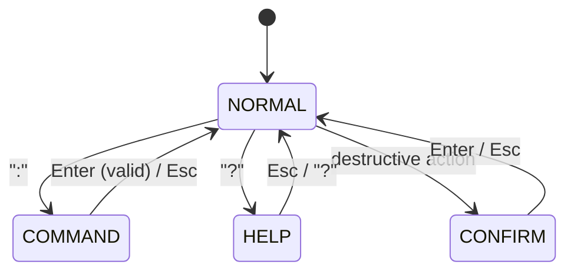

# Dashboard Keyboard Navigation Spec

Version: v1.0
Date: 2026-02-12
Status: Implementation-ready
Scope: VIM-style keyboard command layer on top of existing dashboard
Target: `dashboard.py` embedded HTML, minimal `bot.py` hardening

---

## 1. Goal

Add keyboard-driven command and navigation to the existing dashboard. No visual redesign. The current layout, colors, tables, and controls stay as-is. This spec adds a keyboard engine on top.

---

## 2. Modes

Four modes, indicated by a small mode badge in the header bar.

| Mode | Entry | Exit | Purpose |
|------|-------|------|---------|
| **NORMAL** | Default / `Esc` | `:` → COMMAND, `?` → HELP | Navigate slots, quick actions |
| **COMMAND** | `:` | `Enter` / `Esc` → NORMAL | Execute named actions |
| **HELP** | `?` | `Esc` / `?` → NORMAL | Read-only keybinding reference |
| **CONFIRM** | Destructive action | `Enter` / `Esc` → NORMAL | Y/N gate |

Existing `<input>` elements (Entry%, Profit%) work normally — clicking them captures keyboard input. `Esc` or blur returns to NORMAL. This is implicit, not a formal mode.

All mode key handlers call `event.preventDefault()` to suppress browser defaults (Space = scroll, `/` = find).



**Invariants**:
- Exactly one mode active at all times.
- CONFIRM blocks all keys except `Enter` and `Esc`.
- Chord buffer cleared on any mode exit.

---

## 3. NORMAL Mode Keybindings

### Slot Navigation

| Key | Action |
|-----|--------|
| `1`-`9` | Jump to slot by index |
| `]` | Next slot |
| `[` | Previous slot |
| `g g` | Jump to first slot (chord, 400ms timeout) |
| `G` | Jump to last slot |

For >9 slots: use `]`/`[` to cycle, or `:jump N` command.

### Quick Actions

| Key | Action |
|-----|--------|
| `p` | Toggle pause/resume |
| `+` | Add slot |
| `-` | Soft close next recovery |
| `?` | Toggle help overlay |
| `.` | Force refresh (rate-limited: 2s cooldown) |
| `:` | Open command bar |
| `Esc` | Close any overlay, return to NORMAL |

---

## 4. COMMAND Mode

`:` opens a command bar fixed to the bottom of the viewport. Monospace font, dark background, colon prefix.

### 4.1 Commands

| Command | Action | API Payload |
|---------|--------|-------------|
| `:pause` | Pause bot | `{action: "pause"}` |
| `:resume` | Resume bot | `{action: "resume"}` |
| `:add` | Add slot | `{action: "add_slot"}` |
| `:close` | Soft close next | `{action: "soft_close_next"}` |
| `:close <slot> <rid>` | Soft close specific | `{action: "soft_close", slot_id: N, recovery_id: M}` |
| `:set entry <value>` | Set entry % | `{action: "set_entry_pct", value: X.Y}` |
| `:set profit <value>` | Set profit % | `{action: "set_profit_pct", value: X.Y}` |
| `:jump <N>` | Jump to slot N | Client-side only |
| `:q` | No-op (VIM habit safety) | — |

### 4.2 Parser

```js
const raw = input.value.trim();
if (!raw.startsWith(':')) return;
const tokens = raw.slice(1).trim().split(/\s+/);
const verb = tokens[0] || '';

if (verb === 'set' && tokens.length >= 3) {
  const sub = tokens[1];
  const val = parseFloat(tokens[2]);
  if (sub === 'entry')  return { action: 'set_entry_pct', value: val };
  if (sub === 'profit') return { action: 'set_profit_pct', value: val };
  return { error: 'unknown set target: ' + sub };
}
if (verb === 'close' && tokens.length >= 3) {
  return { action: 'soft_close', slot_id: parseInt(tokens[1]), recovery_id: parseInt(tokens[2]) };
}
if (verb === 'close') return { action: 'soft_close_next' };
// simple verb lookup for pause, resume, add, jump, q
```

### 4.3 Client-Side Validation

Before dispatching to `/api/action`:

1. `:set` values must be finite positive floats, `>= 0.05` and `<= 50.0`.
2. `:close <slot> <rid>` args must parse as non-negative integers.
3. Unknown commands → error toast, no API call.

### 4.4 Auto-Complete

Known completions: `pause`, `resume`, `add`, `close`, `set entry`, `set profit`, `jump`, `q`.

- `Tab` cycles through prefix-matched suggestions (shown above bar, max 5).
- No fuzzy matching.

### 4.5 Command History

In-memory array of last 20 executed commands. `Up`/`Down` arrows to recall. Resets on page reload.

---

## 5. Help Overlay

`?` toggles a centered modal showing all keybindings. Monospace cheatsheet layout:

```
┌─ Keybindings ────────────────────────┐
│                                       │
│  NAVIGATION        ACTIONS            │
│  1-9   slot jump   p    pause/resume  │
│  [/]   prev/next   +    add slot      │
│  gg    first slot   -    close next   │
│  G     last slot    .    refresh      │
│                     :    command      │
│                     ?    this help    │
│                     Esc  close        │
│                                       │
│  COMMAND BAR                          │
│  :pause  :resume  :add  :close       │
│  :set entry N  :set profit N         │
│  :jump N                             │
│  Tab=complete  ↑↓=history  Esc=close │
│                                       │
└──────────────────── Esc to close ────┘
```

Backdrop: `rgba(0,0,0,0.5)`. Closes with `Esc` or `?`.

---

## 6. Confirmation Dialog

Destructive actions require `Enter` to confirm, `Esc` to cancel.

| Action | Confirm? | Dialog Text |
|--------|----------|-------------|
| Pause | Yes | "Pause bot? Active orders remain open." |
| Resume | No | Immediate |
| Add Slot | No | Immediate |
| Soft Close | Yes | "Close recovery #N on slot #M?" / "Close oldest recovery?" |
| Set Entry/Profit % | Yes if relative change > 50% | "Change entry from X% to Y%?" |

Relative change: `abs(new - old) / old > 0.5`. If `old === 0`, always confirm.

Dialog: centered box, `--panel` background, two buttons (Confirm/Cancel), focus trapped.

---

## 7. Toast Notifications

Replace the `#ctlMsg` text span with a simple toast stack.

1. Bottom-right corner, max 3 visible.
2. Auto-dismiss: 4s success/info, 8s error.
3. Types: `success` (green left border), `error` (red left border), `info` (blue left border).
4. All command results produce a toast.

---

## 8. Poll Debounce

When in COMMAND, CONFIRM, or HELP mode:

1. Poll data is stored but DOM is **not** re-rendered (prevents focus loss, command bar dismissal).
2. On mode exit back to NORMAL, render the most recent poll data in a single update.

This prevents a 5-second poll from disrupting mid-interaction.

---

## 9. Backend Hardening

### 9.1 Pre-Lock Validation

Move input parsing **before** lock acquisition in `/api/action`:

```python
def do_POST(self):
    try:
        body = self._read_json()
    except Exception:
        self._send_json({"ok": False, "message": "invalid request body"}, 400)
        return

    action = (body.get("action") or "").strip()
    parsed = {}

    if action in ("set_entry_pct", "set_profit_pct"):
        try:
            parsed["value"] = float(body.get("value", 0))
            if not math.isfinite(parsed["value"]):
                raise ValueError
        except (TypeError, ValueError):
            self._send_json({"ok": False, "message": "invalid numeric value"}, 400)
            return
    elif action == "soft_close":
        try:
            parsed["slot_id"] = int(body.get("slot_id", 0))
            parsed["recovery_id"] = int(body.get("recovery_id", 0))
        except (TypeError, ValueError):
            self._send_json({"ok": False, "message": "invalid slot/recovery id"}, 400)
            return
    elif action in ("pause", "resume", "add_slot", "soft_close_next"):
        pass
    else:
        self._send_json({"ok": False, "message": f"unknown action: {action}"}, 400)
        return

    with _RUNTIME.lock:
        ...  # dispatch with pre-validated values
```

### 9.2 Catch-All Wrapper

```python
def do_POST(self):
    try:
        # ... all dispatch logic ...
    except Exception:
        logger.exception("Unhandled exception in /api/action")
        self._send_json({"ok": False, "message": "internal server error"}, 500)
```

### 9.3 Error Response Contract

All `/api/action` responses are JSON: `{"ok": true|false, "message": "..."}`.

The frontend handles all response shapes:
- JSON 200: success path.
- JSON 400/500: extract `message`, show error toast.
- Non-JSON / network failure: show generic error toast.

---

## 10. New CSS Tokens

Add to existing `:root`:

```css
--cmd-bg: #161b22;        /* command bar background */
--backdrop: rgba(0,0,0,0.5);  /* modal backdrop */
--toast-bg: #1c2128;      /* toast background */
```

---

## 11. Implementation Structure

All JS added inline to the existing `<script>` block in `dashboard.py`:

```
// --- Keyboard Navigation Layer ---
// 1. Mode state (normal/command/help/confirm)
// 2. Keyboard engine (onKeyDown dispatcher, chord buffer)
// 3. Command parser (tokenizer, validation)
// 4. Command bar (show/hide, auto-complete, history)
// 5. Help modal (show/hide)
// 6. Confirm dialog (show/hide, pending action)
// 7. Toast system (create/dismiss/stack)
// 8. Poll debounce (deferred render flag)
```

New HTML elements (hidden by default):
- Command bar (`<div id="cmdBar">`)
- Help modal (`<div id="helpModal">`)
- Confirm dialog (`<div id="confirmDialog">`)
- Toast container (`<div id="toasts">`)
- Mode badge (in header)

---

## 12. Testing Criteria

1. Every action reachable without mouse in < 3 keypresses from NORMAL.
2. Typing in Entry%/Profit% inputs never triggers shortcuts.
3. `g` followed by nothing for 500ms does not trigger `gg`.
4. Pause/soft-close blocked until Enter confirmation.
5. `:set entry abc` and `:set entry -1` produce error toasts, no API call.
6. 10 rapid actions produce max 3 visible toasts.
7. Opening command bar and waiting > 5s: poll doesn't dismiss bar.
8. While in CONFIRM, `:`, `?`, `p`, `1`-`9` have no effect.
9. `.` pressed 10 times in 1s produces at most 1 API call.
10. Malformed POST body returns `{"ok": false, ...}` JSON, never HTML 500.

---

## 13. Milestones

| Phase | Scope | Backend? |
|-------|-------|----------|
| M1 | Backend hardening (9.1, 9.2) | **Yes** |
| M2 | Keyboard engine + mode FSM + slot navigation | No |
| M3 | Command bar + parser + validation + auto-complete + history | No |
| M4 | Help overlay + confirm dialog + toast system + poll debounce | No |

M1 ships first. M2-M4 are frontend-only and independently shippable.

---

## 14. Out of Scope

- Visual redesign (colors, typography, layout)
- Connection FSM / heartbeat / stale overlay
- Table sorting
- Slot detail drawer
- Responsive/mobile adaptation
- Favicon / branding
- Industrial aesthetic
- Accessibility audit
- Factory Lens integration

These may be added later as independent specs.
